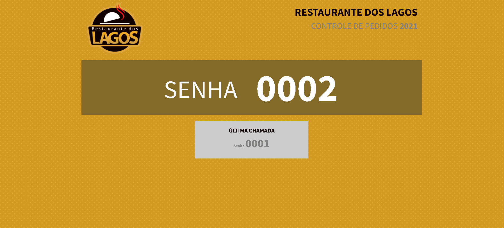
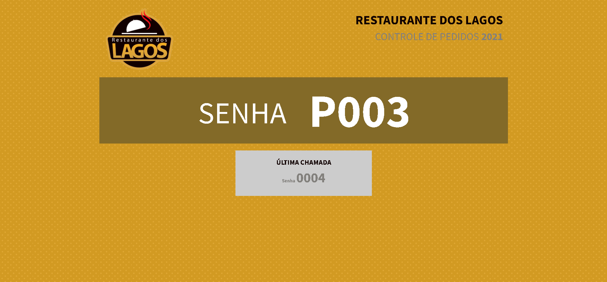

# Restaurant counter
The "Restaurant Counter" is a password counter for restaurants, in order to assist in the organization and control of daily sales.
*O "Contador para restaurante" é um contador de senhas para restaurantes, afim de auxiliar na organização e no controle de vendas diárias.*

---

## Languages used

- HTML 
- CSS 
- JS 

---

## How to use ?

- Pressing the arrow to the right of the keyboard (↦) informs the next normal password number. Without.

  *Ao apertar a seta para o lado direito do teclado (↦) é informado o próximo número de senha normal. Sem prioridade.*

- Pressing the arrow to the left of the keyboard (↤) the previous number of normal password is informed. No priority.

  *Ao apertar a seta para o lado esquerdo do teclado (↤) é informado o número anterior de senha normal. Sem prioridade.*
  
  

- Pressing the up arrow on the keyboard (↥) informs the next priority password number.

  *Ao apertar a seta para cima do teclado (↥) é informado o próximo número de senha prioritária.*

- When pressing the down arrow on the keyboard (↧) the previous number of priority password is informed.

  *Ao apertar a seta para baixo do teclado (↧) é informado o número anterior de senha prioritária*

